# Project One: Exploratory Data Analysis

# Team Name: 007

# Project Overview:
A Swedish music streaming start-up launched in 2008, Spotify began as an ethical answer to controversial file sharing sites like Napster and LimeWire by offering users a free service with advertisements or an optional monthly ad-free subscription for a nominal fee, using some of the revenue generated to compensate artists for their music.  

Today, over 50% of all music is accessed via streaming services, and Spotify is the most used streaming platform. With 456 million monthly users in 183 regions, it accounts for roughly one third of all music streaming listeners worldwide.  European users account for the largest percentage of active monthly users at 32%, but while North American listeners account for 22%, this market also has Spotify’s highest amount of active daily usage.  

Now, more than ever before, stakeholders in the music industry have immediate and detailed information on how individual artists are being received by music lovers around the globe.  Previously only trackable through direct purchases such as concert tickets and album sales, now stakeholders can see not only the popularity of these artists, but where in the world they are most popular, even down to which songs of theirs have the highest number of streams.  

Thanks to playlists and individual track selection being prioritized over comprehensive albums, single songs hold far more weight than in the past.  Record labels, in particular, have become increasingly dependent on these datasets, often reviewing Spotify statistics to make informed decisions on whom to promote, and where. In fact, labels as large as Sony use Spotify as the main indicator for chart successes.  Not only is Sony a major rightsholder on the Spotify platform, it is also a significant shareholder. 

Using Spotify API and a kaggle dataset called Spotify Charts, a resource of all daily hit charts from 2017 – 2022, we looked at the difference between global listener trends and compared them with that of the US, Spotify’s largest active daily user base.  

# Project Structure:
After reviewing many potential Spotify datasets, we chose one that holds the entire “Top 200” songs published globally between 2017 and 2021, a resource with 164,807 values.  We first reviewed and cleaned this dataset to eliminate irrelevant categories, consolidated the findings by year, and cleaned the text to increase legibility and reduce potential errors.  

The project collaborators worked as a team to ask relevant questions that could be answered by this dataset and build data visualizations that would help us communicate the most important aspects to our audience, including tables, graphs, and a Google Slides presentation to highlight key elements from our findings. 

Our project code can be found here: https://github.com/a-barbera/Project-One-Group-7

# Project Contributors:
1. Anna Barbera
2. Tanner Horton
3. Jonathan Michel
4. Victor Pang
5. Bronwyn Milne

# Objective:
Analyze music data trends and find out which markets hold the most influence over global music trends and determine if song and artist popularity in the largest market is reflective of global preferences as well.  
# Hypothesis:
<b>Hypothesis:</b> The top streaming market will have a substantial influence over global charts.

<b>Null:</b> The top streaming market will not have a substantial influence over global charts.

<b>Alternative:</b> The top streaming market will have a substantial negative influence over global charts.

# Methodology:
We chose Kaggle’s Spotify Charts “Top 200” dataset, [found here](https://www.kaggle.com/datasets/dhruvildave/spotify-charts?resource=download).  Using Pandas, we cleaned it by eliminating categories not relevant to our study, checked it for duplicates, consolidated the findings by year, and cleaned the text to increase legibility and reduce potential problems. 

We then used Pandas, Matplotlib, and statistical tests such as a chi-squared test and p-values to build different ways of looking at the information and to run tests on our hypothesis.  Using tables to sort, evaluate, and categorize our findings, we then created graphs and diagrams to help visualize these findings.  

Lastly, we developed a team presentation and a robust Google Slides folder of graphs and key elements to support our findings and facilitate audience engagement. 

# Research Questions
 <b>Question One:  Which Countries are Most Influential on the Global Spotify Market?</b>

Our analysis shows that the United States has the highest amount of total streams and accounts for 21% of total global streams between the years of 2017 - 2021, significantly higher than any other individual region represented in our dataset.  

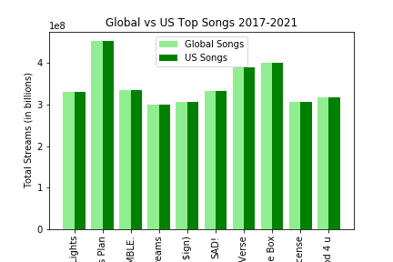
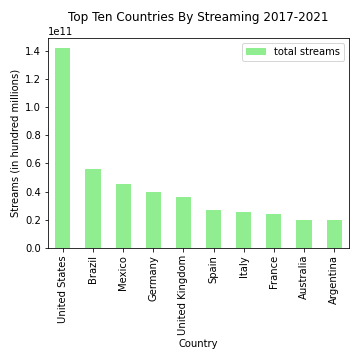
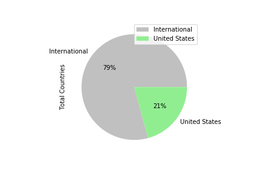

<b>Question Two: How do Rankings of Top Songs in the Top Streaming Country Compare to the Global Rankings? 
</b>

In 2017, the US charts had 60% of the same top 100 songs as the global charts.

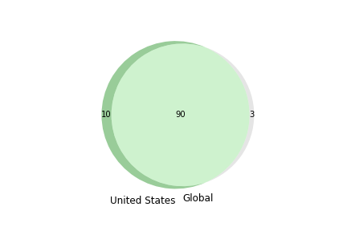

In 2017, the US charts had 50% of the same top 10 songs as the global charts.

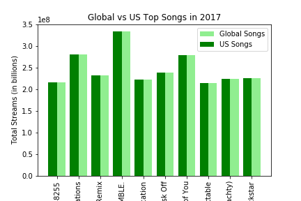

In 2018, the US charts had 63% of the same top 100 songs as the global charts in 2018.

In 2018, the US charts had 70% of the same top 10 songs as the global charts.

In 2019, the US charts had 63% of the same top 100 songs as the global charts.

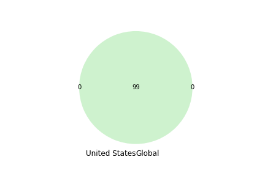

In 2019, the US charts had 40% of the same top 10 songs as the global charts.

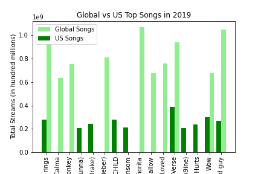

In 2020, The US charts had 57% of the same top 100 songs as the global charts.

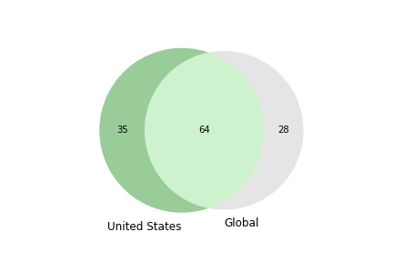

In 2020, the US charts had 40% of the same top 10 songs as the global charts.

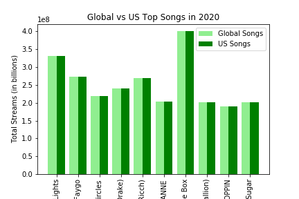

In 2021, The US charts had 66% of the same top 100 songs as the global charts.

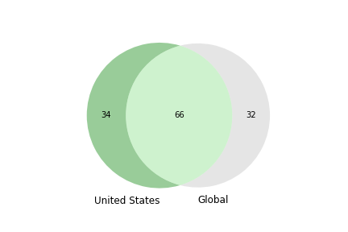

In 2021, the US charts had 70% of the same top 10 songs as the global charts.

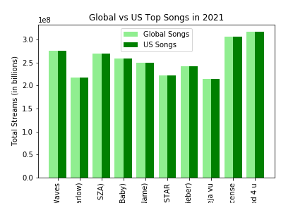

The US charts had 56% of the same top 100 songs as the global charts from 2017 to 2021.

We used a chi squared test to determine if the data matched our expectations of how influential the US song charts would be, considering the market makes up 21% of Spotify streams in our timeframe. Since the chi square value of 73.84 exceeds the critical value of 3.84, we conclude that the results are statistically significant and can reject the null hypothesis. 

<b>Question Three: How does the Top Song of Each Year (2017-2021) Perform in the Top 10 Streaming Countries?</b>

<b>Question Four: Which Artists Are the Most Popular Globally (2017-2021)?</b>

The top ten most popular artists during this time frame:

1. Post Malone
2. Ed Sheeran
3. Drake
4. Bad Bunny
5. Billie Eilish
6. J Balvin
7. Ariana Grande
8. The Weeknd
9. Juice World
10. Dua Lipa

Between the years of 2017 and 2021, the United States (the region with the highest amount of total streams) shared 50% of the same top ten artists as the global rankings.

# Conclusion:

The U.S. market makes up 21% of the total global Spotify streams from 2017 - 2021 represented by our dataset.

From 2017 - 2021, the U.S. top ten artists had a 50% overlap with global top ten artists.

From 2017 - 2021, the U.S. had at least 56% of the same songs as the global charts. 

The top song of each year had the highest number of streams from the U.S. market. 

We reject the null hypothesis, as our studies support the idea that the largest market will have the greatest influence on global trends.

# Study Limitations:

This study is limited to only songs that achieved a "Top 200" status between the years of 2017 and 2021.  
This study is also limited to the 68 unique regions available using Spotify API, when Spotify is available in a total of 183 regions worldwide.  Additionally this is still limited as Spotify is not universally accessible.
This study is only limited to data gleaned from Spotify.  Other popular music streaming services include Apple Music, Amazon Music, and YouTube Music. 

# Future Exploratory Analysis:
Future analysis could include:

1. Researching datasets from other music streaming services and combining those results with that of Spotify.

2. Further use of Spotify API to analyze what categorical features the most popular songs and artists have in common.

3. Further research into the connection between record labels and streaming services.

4. Further consideration of population sizes and the parts they play in determining popularity.

# References: 
https://www.kaggle.com/datasets/dhruvildave/spotify-charts?resource=download

https://www.kaggle.com/code/pavansanagapati/spotify-music-api-data-extraction-part1

https://www.kaggle.com/code/tanersekmen/spotify-50-song-analysis

https://seekingalpha.com/article/4516217-spotify-labels-interdependent

https://www.demandsage.com/spotify-stats/#:~:text=256%20million%20of%20Spotify's%20monthly,precise%2C%20as%20of%20September%202022.

https://www.rug.nl/news/2020/06/how-spotify-is-influencing-the-music-industry?lang=en

https://www.bbc.com/news/newsbeat-43240886

https://www.businessofapps.com/data/spotify-statistics/

https://newsroom.spotify.com/company-info/

https://www.bbc.com/news/business-60881567

https://thetowerinfo.com/listen-spotify-china/

https://worldpopulationreview.com/countries
