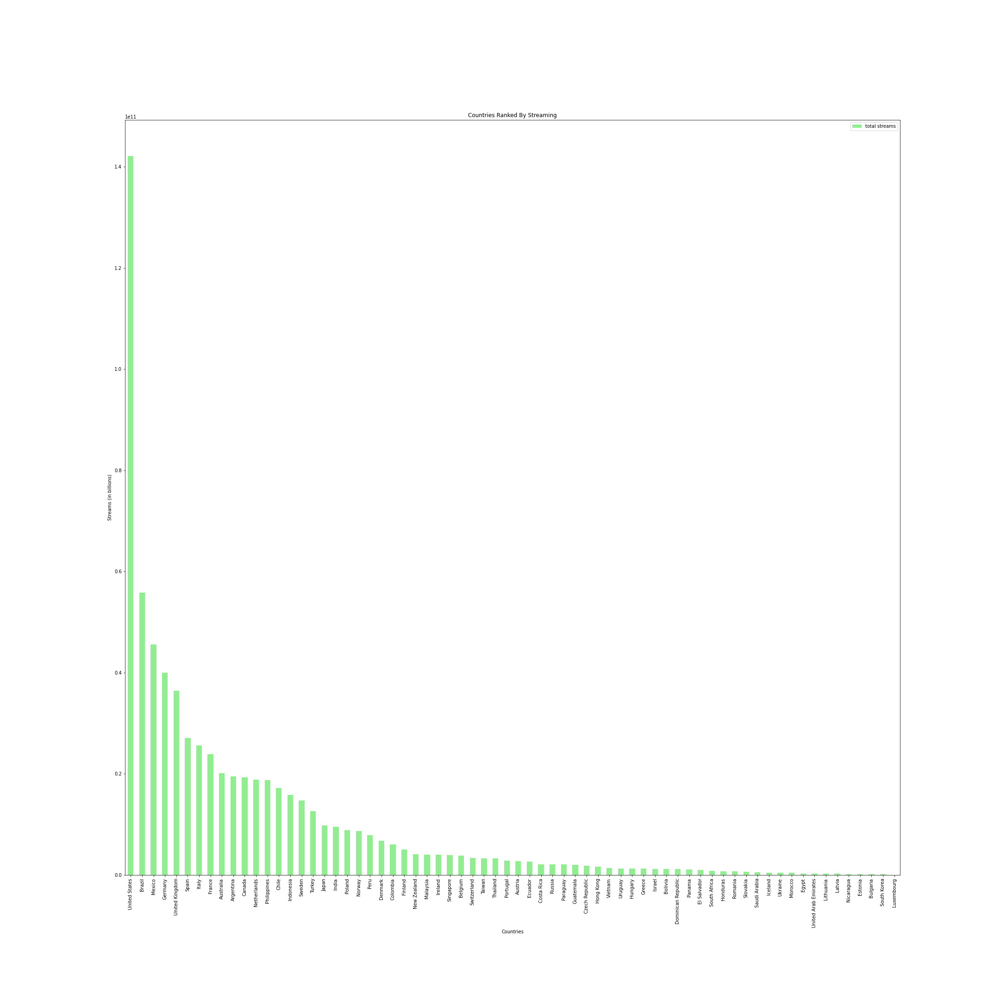

# Project-One-Group-7
project 1 EDA Analysis

# Project Overview:
A Swedish music streaming start-up launched in 2008, Spotify began as an ethical answer to controversial file sharing sites like Napster and LimeWire by offering users a free service with advertisements or an optional monthly ad-free subscription for a nominal fee, using some of the revenue generated to compensate artists for their music.  

Today, over 50% of all music is accessed via streaming services, and Spotify is the most used streaming platform. With 456 million monthly users in 183 regions, it accounts for roughly one third of all music streaming listeners worldwide.  European users account for the largest percentage of active monthly users at 32%, but while North American listeners account for 23%, this market also has Spotify’s highest amount of active daily usage.  

Now, more than ever before, stakeholders in the music industry have immediate and detailed information on how individual artists are being received by music lovers around the globe.  Previously only trackable through direct purchases such as concert tickets and album sales, now stakeholders can see not only the popularity of these artists, but where in the world they are most popular, even down to which songs of theirs have the highest number of streams.  

Thanks to playlists and individual track selection being prioritized over comprehensive albums, single songs hold far more weight than in the past.  Record labels, in particular, have become increasingly dependent on these datasets, often reviewing Spotify statistics to make informed decisions on whom to promote, and where. In fact, labels as large as Sony use Spotify as the main indicator for chart successes.  Not only is Sony a major rightsholder on the Spotify platform, it is also a significant shareholder. 

Using Spotify API and a kaggle dataset called Spotify Charts, a resource of all daily hit charts from 2017 – 2022, we looked at the difference between global listener trends and compared them with that of the US, Spotify’s largest active daily user base.  

# Project Structure:
After reviewing many potential Spotify datasets, we chose one that holds the entire “Top 200” songs published globally between 2017 and 2021, a resource with 164,807 values.
Our project code can be found ___
We also created a Google Slides presentation to highlight key elements and visuals from our findings. 
# Project Contributors:
1. Anna Barbera
2. Tanner Horton
3. Jonathan Michel
4. Victor Pang
5. Bronwyn Milne

# Objective:
Analyze music data trends and find out which markets hold the most influence over global music trends and determine if song and artist popularity in the largest market is reflective of global preferences as well.  
# Hypothesis:
<b>Hypothesis:</b> The top streaming market will have a substantial influence over global charts.

<b>Null:</b> The top streaming market will not have a substantial influence over global charts.

<b>Alternative:</b> The top streaming market will have a substantial negative influence over global charts.

# Methodology:
We chose Kaggle’s Spotify Charts “Top 200” dataset, [found here](https://www.kaggle.com/datasets/dhruvildave/spotify-charts?resource=download).  Using Pandas, we cleaned it by eliminating categories not relevant to our study, checked it for duplicates, consolidated the findings by year, and cleaned the text to increase legibility and reduce potential problems. 
# Research Questions
 <b>Question One:  Which Countries Are Most Influential on the Global Spotify Market?</b>

Our analysis shows that the United States has the highest amount of total streams and accounts for 26% of total global streams.  

<b>Question Two: What Are the Top Ranked Songs and Artists Globally?</b>

<b>Question Three: What Are the Top Ranked Songs and Artists in the Top Streaming Country?</b>

<b>Question Four: What Percentage of the Top Songs and Artists in the Top Streaming Country Are a Part of Global Rankings</b>

# Conclusion:

# Study Limitations:
This study is limited to only songs that achieved a "Top 200" status between the years of 2017 and 2021.  
This study is also limited to the 68 unique regions available using Spotify API, when Spotify is available in a total of 183 regions worldwide. 

# Future Exploratory Analysis:

# References: 
https://www.kaggle.com/datasets/dhruvildave/spotify-charts?resource=download

https://www.kaggle.com/code/pavansanagapati/spotify-music-api-data-extraction-part1

https://www.kaggle.com/code/tanersekmen/spotify-50-song-analysis

https://seekingalpha.com/article/4516217-spotify-labels-interdependent

https://www.demandsage.com/spotify-stats/#:~:text=256%20million%20of%20Spotify's%20monthly,precise%2C%20as%20of%20September%202022.

https://www.rug.nl/news/2020/06/how-spotify-is-influencing-the-music-industry?lang=en

https://www.bbc.com/news/newsbeat-43240886

https://www.businessofapps.com/data/spotify-statistics/

https://newsroom.spotify.com/company-info/
